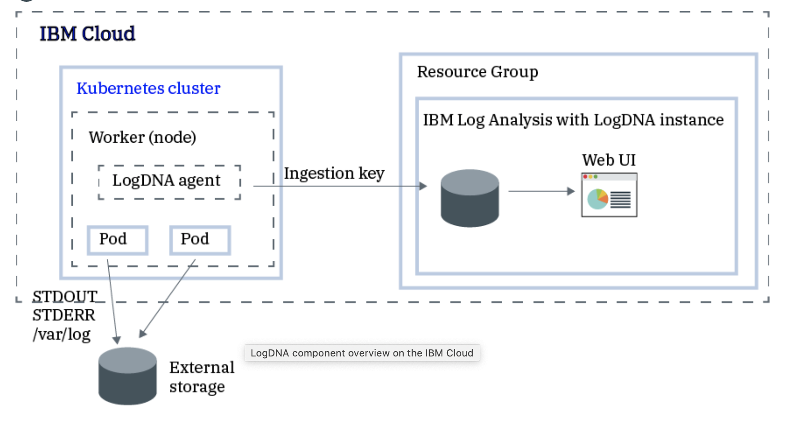
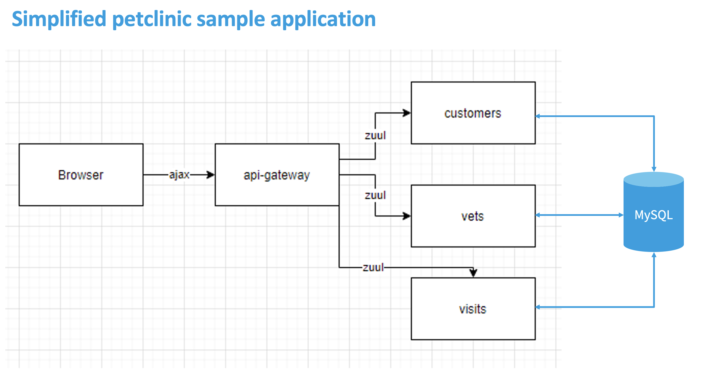

# LogDNA Introduction

# Manage logs with LogDNA in IBM Cloud

`IBM Log Analysis with LogDNA` allows you to capture your application and environment logs, filter out noisy or irrelevant log lines, alert, search, and archive your log data. You can build real-time dashboards with highly interactive graphs, including Counters, Gauges, Tables, and Time-Shifted Graphs.

This exercise shows how the `IBM Log Analysis with LogDNA` service can be used to configure and access logs of a Kubernetes application that is deployed on IBM Cloud. You will deploy a Spring Java application to a cluster provisioned on IBM Cloud Kubernetes Service, configure a LogDNA agent, generate application logs and access worker logs, pod logs or network logs. Then, you will search, filter and visualize those logs through Log Analysis with LogDNA Web UI.

The diagram below illustrates the service landscape used for this repo.

Adopted from repo [Spring PetClinic Microservice example running on Kubernetes(in Korean)](https://github.com/hongjsk/spring-petclinic-kubernetes), [Analyze logs and monitor application health with LogDNA and Sysdig](https://cloud.ibm.com/docs/solution-tutorials?topic=solution-tutorials-application-log-analysis) and [IBM Cloud Patterns](https://ibm.github.io/cloud-enterprise-examples/).

## Sample application architecture

A simplified version of `petclinic` application is used in this repo. It includes four microservice components:

  - api-gateway
  - customers
  - vets
  - visits

The complete version of `petclinic` application with microservice architecture is available [here](https://github.com/spring-petclinic/spring-petclinic-microservices).

## Pre-requisites

Claim your kubernetes cluster and complete the setup steps as described [here](../../setup/README.md).

## Exercise Steps

  * Lab 1 - [Deploy and Setup IBM Log Analysis with LogDNA](../lab-1/README.md)
  * Lab 2 - [Deploy sample application to IKS cluster](../lab-2/README.md)
  * Lab 3 - [Generate application log entries and analyze logs](../lab-3/README.md)
  * Lab 4 - [Log streaming via LogDNA](../lab-4/README.md)

## Related Links

There is lots of great information, tutorials, articles, etc on the [IBM Developer site](https://developer.ibm.com) as well as broader web. Here are a subset of good examples related to data understanding, visualization and processing:

- [Log Analysis with LogDNA Documentation](https://cloud.ibm.com/docs/Log-Analysis-with-LogDNA?topic=Log-Analysis-with-LogDNA-getting-started)
- [LogDNA Documentation](https://docs.logdna.com/docs)
- [LogDNA Blog](https://logdna.com/blog/)

