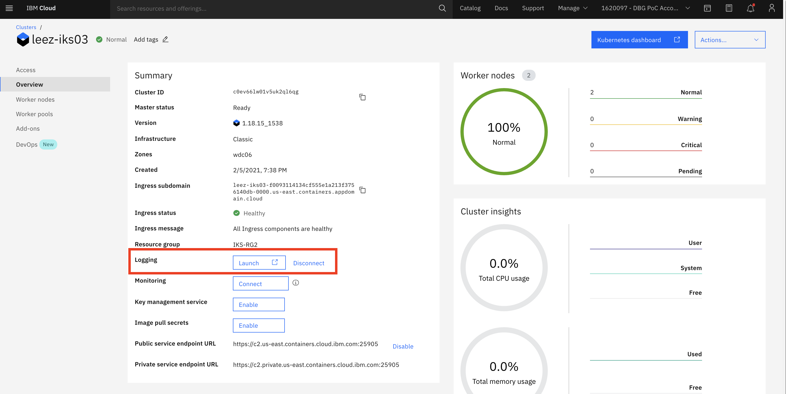

# Deploy and Setup IBM Log Analysis with LogDNA

`IBM Log Analysis with LogDNA` allows you to capture your application and environment logs, filter out noisy or irrelevant log lines, alert, search, and archive your log data. You can build real-time dashboards with highly interactive graphs, including Counters, Gauges, Tables, and Time-Shifted Graphs.

## Step 1 - Deploy IBM Log Analysis with LogDNA

To deploy an instance of `IBM Log Analysis with LogDNA`,

1. Login to [IBM Cloud](https://cloud.ibm.com) in a browser.

1. Navigate to https://cloud.ibm.com/observe/logging to view available `IBM Log Analysis with LogDNA` instance.

    

1. Select `Create instance` at the top-right corner.

1. Select a location, for example `us-east`.

1. Select a `pricing plan`. Lite plan is available.

1. Give a service name or accept the default.

1. Click `Create` to create the new service instance.

    

## Step 2 - Connect your application and IKS cluster to LogDNA

To collect logs from IKS cluster and related applications, LogDNA agent will be installed on each node of the cluster.

1. Login to [IBM Cloud](https://cloud.ibm.com) in a browser.

1. Locate and open the IKS cluster that you intend to collect logs from.

1. Make sure the `Overview` tab is selected in the left pane.

    

1. Select the `Connect` button next to the `Logging`.

1. Select a region, for example `Washington DC`.

1. Select your LogDNA instance.

    

1. Select `Connect` to install LogDNA agent on all IKS cluster nodes.

    

1. LogDNA is ready to collect logs from applications in the cluster and cluster itself.