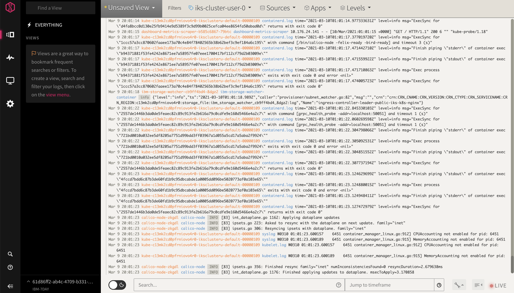

# Deploy and Setup IBM Log Analysis with LogDNA

`IBM Log Analysis with LogDNA` allows you to capture your application and environment logs, filter out noisy or irrelevant log lines, alert, search, and archive your log data. You can build real-time dashboards with highly interactive graphs, including Counters, Gauges, Tables, and Time-Shifted Graphs.

## Step 1: Deploy IBM Log Analysis with LogDNA

To deploy an instance of `IBM Log Analysis with LogDNA`,

1. Login to [IBM Cloud](https://cloud.ibm.com) in a browser.

1. Click [here](https://cloud.ibm.com/observe/logging) open the `IBM Cloud Logging` and view the `IBM Log Analysis with LogDNA` instances provisioned under your account.

    [  ](images/observability.png)

1. Select `Create instance` at the top-right corner.

1. Select a location, for example `us-east`. (Pick the location where the IKS cluster resides.)

1. Select a `pricing plan`. Lite plan is available.

1. Enter a service name or accept the default.

1. Click the `Create` button to create the new service instance.

    [  ](images/observability02.png)


## Step 2: Connect your Kubernetes cluster to LogDNA

To collect logs from IKS cluster and related applications, LogDNA agent will be installed on each node of the cluster.

1. Login to [IBM Cloud](https://cloud.ibm.com) in a browser.

1. Locate and open the IKS cluster that you intend to collect logs from.

1. Make sure the `Overview` tab is selected in the left pane.

    

1. Click on the `Connect` button next to the `Logging`. This step connects your cluster to the LogDNA instance.

1. Select the `Region` where LogDNA instance was provisioned, for example `Dallas`.

1. Select your LogDNA instance. Uncheck the `Use private endpoint` box. Click the `Connect` button to install LogDNA agent on all IKS cluster nodes.

    

1. The connect or the agent install step creates a set of resources under `ibm-observe` namespace. To view those changes, run the command as shown below from the CLI environment:

    ```bash
    kubectl get all -n ibm-observe
    ```
    ```
    kubectl get all -n ibm-observe
    NAME                     READY   STATUS    RESTARTS   AGE
    pod/logdna-agent-2rqsd   1/1     Running   0          24s
    pod/logdna-agent-gz4mw   1/1     Running   0          24s

    NAME                          DESIRED   CURRENT   READY   UP-TO-DATE   AVAILABLE   NODE SELECTOR   AGE
    daemonset.apps/logdna-agent   2         2         2       2            2           <none>          24s
    ```
    This shows two agnet pods in `Running` state, one per worker node.

## Step 3: Accessing LogDNA console

1. Click on the `Launch` button to open the LogDNA console in a new browser window.

    

1. The Dashboard should open up with some existing log statements from the cluster that pertains to the Kubernetes system pods.
    [ ](images/launch-console.png)

1. Check the options available under `Filter` dropdowns.
    

1. LogDNA is ready to collect logs from applications in the cluster and the cluster itself. We will dive deeper into log analysis and the use of filters in the later labs.


