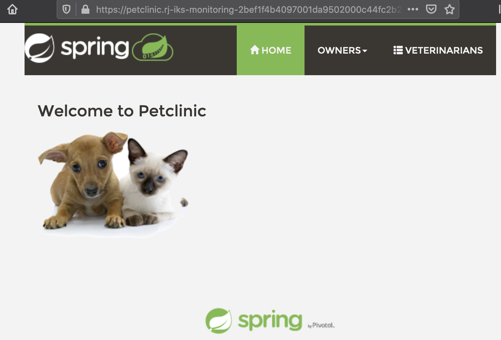

# Deploy sample application to IKS cluster

In this lab, you will deploy the `Petclinic` application into your kubernetes cluster. Check the lab [introduction](lab-0/README.md) to learn more about this application. Logs from the application will be used for analysis in the next set of labs.

## Step 1: Deploy the Petclinic application

In the `IBM Cloud Shell`, deploy the sample petclinic application.

1. Deploy four microservices of the sample petclinic application by running the command below: 
    ```
    kubectl create -f k8s/app/
    ```
    ```
    $ kubectl create -f k8s/app/
    deployment.apps/api-gateway created
    service/api-gateway created
    deployment.apps/customers created
    service/customers-service created
    deployment.apps/vets created
    service/vets-service created
    deployment.apps/visits created
    service/visits-service created
    ```
    This deploys `Deployment` and `Service` resources for each microservice component.


1. Verify the deployment resources. Note that 4 pods and 4 services in addition to deployments and replicaset are created for this deployment.
    ```bash
    kubectl get all
    ```
    ```
    $ kubectl get all
    NAME                               READY   STATUS    RESTARTS   AGE
    pod/api-gateway-575f59b7d8-7jhmc   1/1     Running   0          52s
    pod/customers-687749cfb-g8mkv      1/1     Running   0          52s
    pod/vets-6bb6655b7f-wkbcw          1/1     Running   0          52s
    pod/visits-784749c647-lczr6        1/1     Running   0          52s

    NAME                        TYPE        CLUSTER-IP       EXTERNAL-IP   PORT(S)        AGE
    service/api-gateway         NodePort    172.21.20.70     <none>        80:32002/TCP   52s
    service/customers-service   NodePort    172.21.99.121    <none>        80:32003/TCP   52s
    service/kubernetes          ClusterIP   172.21.0.1       <none>        443/TCP        12h
    service/vets-service        NodePort    172.21.63.239    <none>        80:32005/TCP   52s
    service/visits-service      NodePort    172.21.156.238   <none>        80:32004/TCP   52s

    NAME                          READY   UP-TO-DATE   AVAILABLE   AGE
    deployment.apps/api-gateway   1/1     1            1           52s
    deployment.apps/customers     1/1     1            1           52s
    deployment.apps/vets          1/1     1            1           52s
    deployment.apps/visits        1/1     1            1           52s

    NAME                                     DESIRED   CURRENT   READY   AGE
    replicaset.apps/api-gateway-575f59b7d8   1         1         1       52s
    replicaset.apps/customers-687749cfb      1         1         1       52s
    replicaset.apps/vets-6bb6655b7f          1         1         1       52s
    replicaset.apps/visits-784749c647        1         1         1       52s
    ```

## Step 2: Deploy Ingress resource

When deployed the sample application to a non-Lite tier IKS cluster, it's possible to expose the application with an external hostname.

1. Retrieve `Ingress Subdomain`.
    Ensure the value for variable `MYCLUSTER` is set.
    ```
    echo $MYCLUSTER
    ```
    Lookup the value for ingress subdomain and set that value to the environment variable `INGRESS_SUBDOMAIN`.
    ```bash
    ibmcloud ks cluster get -c $MYCLUSTER
    export INGRESS_SUBDOMAIN=`ibmcloud ks cluster get -c $MYCLUSTER --output json | jq -r '.ingressHostname'`
    echo "\n Ingress subdomain: ${INGRESS_SUBDOMAIN}"
    ```
    ```
    Retrieving cluster c0i8ggbd0hnsl5uiaelg...
    OK

    Name:                           rj-iks-monitoring
    ID:                             c0i8ggbd0hnsl5uiaelg
    State:                          normal
    Status:                         All Workers Normal
    Created:                        2021-02-11T01:28:33+0000
    Location:                       dal10
    Pod Subnet:                     172.30.0.0/16
    Service Subnet:                 172.21.0.0/16
    Master URL:                     https://c108.us-south.containers.cloud.ibm.com:30952
    Public Service Endpoint URL:    https://c108.us-south.containers.cloud.ibm.com:30952
    Private Service Endpoint URL:   https://c108.private.us-south.containers.cloud.ibm.com:30952
    Master Location:                Dallas
    Master Status:                  Ready (13 hours ago)
    Master State:                   deployed
    Master Health:                  normal
    Ingress Subdomain:              rj-iks-monitoring-2bef1f4b4097001da9502000c44fc2b2-0000.us-south.containers.appdomain.cloud
    Ingress Secret:                 rj-iks-monitoring-2bef1f4b4097001da9502000c44fc2b2-0000
    Ingress Status:                 healthy
    Ingress Message:                All Ingress components are healthy
    Workers:                        2
    Worker Zones:                   dal10
    Version:                        1.18.15_1538
    Creator:                        -
    Monitoring Dashboard:           -
    Resource Group ID:              ee06e1f30dde43d4a01d71be7501d9bb
    Resource Group Name:            rj-resources

    Ingress subdomain: rj-iks-monitoring-2bef1f4b4097001da9502000c44fc2b2-0000.us-south.containers.appdomain.cloud
    ```

1. Set the application domain name
    Replace `<INGRESS_SUBDOMAIN>` in `k8s/ingress.yaml` file with the value that you retrieved in the previous step by running the following command:

    ```bash
    sed -i "s/<INGRESS_SUBDOMAIN>/${INGRESS_SUBDOMAIN}/" k8s/ingress.yaml
    ```
    Users on Mac:
    ```bash
    sed -i "" "s/<INGRESS_SUBDOMAIN>/${INGRESS_SUBDOMAIN}/" k8s/ingress.yaml
    ```
    Verify the igress value was substituted correctly:
    ```
    $ more k8s/ingress.yaml
    apiVersion: networking.k8s.io/v1beta1
    kind: Ingress
    metadata:
    annotations:
    nginx.ingress.kubernetes.io/rewrite-target: /$1
    name: api-ingress
    spec:
    rules:
    - host: petclinic.rj-iks-monitoring-2bef1f4b4097001da9502000c44fc2b2-0000.us-south.containers.appdomain.cloud
    http:
        paths:
    ...
    ```

1. Deploy the Ingress resource
  ```bash
  kubectl create -f k8s/ingress.yaml
  ```
  ```
  $ kubectl create -f k8s/ingress.yaml
  ingress.networking.k8s.io/api-ingress created
  ```

## Step 3: Verify petclinic application

If everything goes as planned, the `petclinic` application can be accessed at `https://petclinic.<INGRESS_SUBDOMAIN>`. By default, an internal database is used to stored data. Get the application URL by running the comand below. 
```bash
echo "https://petclinic.${INGRESS_SUBDOMAIN}"
```
Copy the URL into a new browser window to view the Petclinc application landing page.



## Step 4: Deploy MYSQL database to the IKS cluster (Optionally)

Instead of running the `petclinic` application on an internal database, you may choose to deploy an instance of `MYSQL` database on the same IKS cluster.


### Step 4.1 - Prepare Persisent Volume

There are various persistent storage options to store the data of `MYSQL` DATABASE, local storage and cloud storage and etc. For the simplicity, the local file system system on the Node server is used for this repo. Execute the command below to create a 5Gi local-volume.

  ```
  kubectl create -f k8s/mysql/local-volumes.yaml
  ```

### Step 4.2 - Create a secret storing MYSQL credential

User and password of `MYSQL` database is stored in a `secret` resource for security reason.

  ```
  kubectl create -f k8s/mysql/mysql-secret.yaml
  ```

### Step 4.3 - Deploy MYSQL database

One deployment, one service and one persistent-volume-claim resources are created when deploying `MYSQL` database.

  ```bash
  kubectl create -f k8s/mysql/mysql.yaml
  ```

### Step 4.4 - Populate MYSQL database

To populate MYSQL database running on the cluster,

1. Retrieve the pod information where MYSQL database is running.

  ```bash
  kubectl get pod -l app=mysql

  NAME                     READY   STATUS    RESTARTS   AGE
  mysql-6d87765586-2q7sn   1/1     Running   0          19h
  ```

1. Store the pod name of MYSQL. 

  ```bash
  export MYSQL_POD=<MYSQL POD NAME>
  ```

1. Copy SQL files to the pod.

  ```bash
  kubectl cp k8s/mysql/sql/mysql-schema.sql $MYSQL_POD:/tmp/
  kubectl cp k8s/mysql/sql/mysql-data.sql $MYSQL_POD:/tmp/
  ```

1. Populate MYSQL database

  ```
  kubectl exec $MYSQL_POD -- sh -c 'mysql -uroot -ppetclinic petclinic < /tmp/mysql-schema.sql'
  kubectl exec $MYSQL_POD -- sh -c 'mysql -uroot -ppetclinic petclinic < /tmp/mysql-data.sql'
  ```

1. Retrieve data from MYSQL database for verification.

  ```
  kubectl exec $MYSQL_POD -- sh -c 'mysql -u root -ppetclinic -e "select * from vets" petclinic'

  mysql: [Warning] Using a password on the command line interface can be insecure.
  id	first_name	last_name
  1 James	Carter
  2	Helen	Leary
  3	Linda	Douglas
  4	Rafael	Ortega
  5	Henry	Stevens
  6	Sharon	Jenkins
  ```

## Step 5: Run sample application on MYSQL database 

`MYSQL` database has been successfully deployed in the same IKS cluster. Now, you are goint to run the sample `petclinic` application on MYSQL database instead of the internal database.

### Step 5.1 - Store database connection information in configMap

To store MYSQL database connection information in `configMap` resource,

  ```
  kubectl create -f k8s/mysql/mysql-configmap.yaml
  ```

### Step 5.2 - Modify sample application deployment to run on MySQL DB

  ```
  kubectl apply -f k8s/mysql/mysql-customers-service.yaml
  kubectl apply -f k8s/mysql/mysql-vets-service.yaml
  kubectl apply -f k8s/mysql/mysql-visits-service.yaml
  ```


## Step 6: Verify petclinic application

1. Retrieve `Ingress Subdomain`.

    ```bash
    echo https://petclinic.$INGRESS_SUBDOMAIN
    ```
    ```
    $ echo https://petclinic.$INGRESS_SUBDOMAIN

    https://petclinic.leez-iks03-2bef1f4b4097001da9502000c44fc2b2-0000.us-south.containers.appdomain.cloud
    ```

1. Access the `petclinic` application via `https://petclinic.$INGRESS_SUBDOMAIN`. Now, it's running on `MYSQL` database instead of the internal database.


