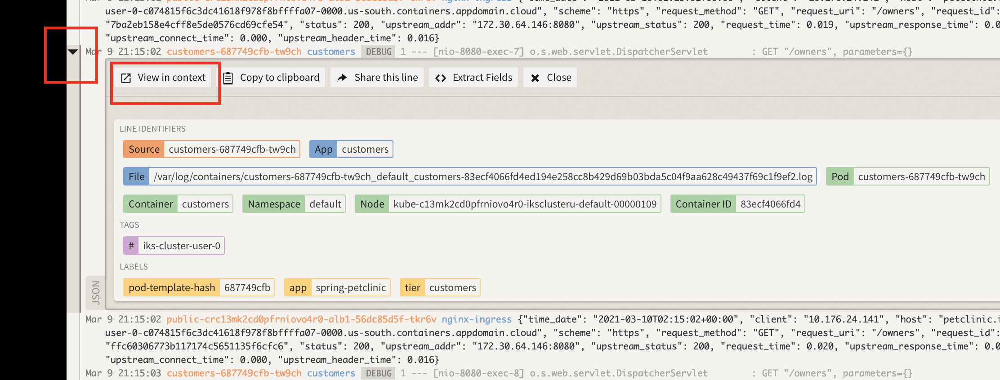

# Analysing logs using LogDNA

## Generate application log entries

The `Petclinic` application was de deployed in the previous exercice. Let's articially create some traffic in order to generate log statements.

For simplicity, a script will be executed in `api-gateway` pod to send REST requests to all 4 service components of the petclinic application. Log entries will be generated for each service component.

## Step 1 - Send requests to the sample application

Prior to sending the requests to the application, we will take a look at the pod logs and start watching the logs. This should provide an understanding of what comes in as log statements.
To generate application log entries, 

1. Go back to CLI terminal and get a listing of pods. Then start watching the logs in separate CLI terminal sessions.
```bash
kubectl get pods
```
```
$  kubectl get pods
NAME                           READY   STATUS    RESTARTS   AGE
api-gateway-575f59b7d8-bjhp8   1/1     Running   0          3h2m
customers-687749cfb-d2zhq      1/1     Running   0          3h2m
vets-6bb6655b7f-v6ppc          1/1     Running   0          3h2m
visits-784749c647-tdpvv        1/1     Running   0          3h2m
```
Watch logs for each of those pods using the follwing command:
```bash
kubectl logs -f <pod-name>
```
For instance the result of wathcing the `api-gateway` pod should like this:
```
$ kubectl logs -f api-gateway-575f59b7d8-bjhp8 
6.4.jar!/, jar:file:/app.jar!/BOOT-INF/lib/jquery-3.1.1-1.jar!/, jar:file:/app.jar!/BOOT-INF/lib/bootstrap-3.3.7-1.jar!/, jar:file:/app.jar!/BOOT-INF/lib/angular-ui-router-1.0.3
.jar!/, jar:file:/app.jar!/BOOT-INF/lib/webjars-locator-core-0.35.jar!/, jar:file:/app.jar!/BOOT-INF/lib/slf4j-api-1.7.26.jar!/, jar:file:/app.jar!/BOOT-INF/lib/commons-lang3-3.
8.1.jar!/, jar:file:/app.jar!/BOOT-INF/lib/commons-compress-1.9.jar!/, jar:file:/app.jar!/BOOT-INF/lib/jackson-core-2.9.8.jar!/]

  .   ____          _            __ _ _
 /\\ / ___'_ __ _ _(_)_ __  __ _ \ \ \ \
( ( )\___ | '_ | '_| | '_ \/ _` | \ \ \ \
 \\/  ___)| |_)| | | | | || (_| |  ) ) ) )
  '  |____| .__|_| |_|_| |_\__, | / / / /
 =========|_|==============|___/=/_/_/_/
 :: Spring Boot ::        (v2.1.4.RELEASE)

2021-02-11 19:58:03.730  INFO 1 --- [           main] o.s.s.p.api.ApiGatewayApplication        : Starting ApiGatewayApplication v2.1.4 on api-gateway-575f59b7d8-bjhp8 with PID 1
 (/app.jar started by root in /)
2021-02-11 19:58:03.731 DEBUG 1 --- [           main] o.s.s.p.api.ApiGatewayApplication        : Running with Spring Boot v2.1.4.RELEASE, Spring v5.1.6.RELEASE
2021-02-11 19:58:03.731  INFO 1 --- [           main] o.s.s.p.api.ApiGatewayApplication        : The following profiles are active: common,docker
.....
.....
2021-02-11 19:59:24.943 DEBUG 1 --- [nio-8080-exec-3] o.s.w.s.handler.SimpleUrlHandlerMapping  : Mapped to ResourceHttpRequestHandler ["classpath:/META-INF/resources/", "classpa
th:/resources/", "classpath:/static/", "classpath:/public/", "/"]
2021-02-11 19:59:24.943 DEBUG 1 --- [nio-8080-exec-1] o.s.w.s.handler.SimpleUrlHandlerMapping  : Mapped to ResourceHttpRequestHandler ["classpath:/META-INF/resources/", "classpa
th:/resources/", "classpath:/static/", "classpath:/public/", "/"]
2021-02-11 19:59:24.949 DEBUG 1 --- [nio-8080-exec-2] o.s.w.s.handler.SimpleUrlHandlerMapping  : Mapped to ResourceHttpRequestHandler ["classpath:/META-INF/resources/", "classpa
th:/resources/", "classpath:/static/", "classpath:/public/", "/"]
2021-02-11 19:59:24.967 DEBUG 1 --- [nio-8080-exec-3] o.s.web.servlet.DispatcherServlet        : Completed 200 OK
```
1. Go back to one of CLI terminal. Set the `HOST` to the `Petclinic` application URL.
```bash
export HOST="https://petclinic.$INGRESS_SUBDOMAIN"
echo $HOST
```
Run the follwing script to generate the log statements. This script will invoke the landing page, vets, owners and pet services in a loop.
```bash
for i in `seq 1 100` ; \
   do \
      echo -e "\n ======= Loop count: $i ========= \nCalling owners:" && \
      wget -q -O - "${HOST}/api/customer/owners" && \
      echo -e "\n Calling vets:" && \
      wget -q -O - "${HOST}/api/vet/vets" && \
      echo -e "\n Calling visits:" && \
      wget -q -O - "${HOST}/api/visit/pets/visits?petId=7" &&  \
      echo -e "\n Calling welcome:" && \
      wget -q -O - "${HOST}/#\!/welcome" ; \
   done
``` 
```
 ======= Loop count: 2 =========
Calling owners:
[{"id":1,"firstName":"George","lastName":"Franklin","address":"110 W. Liberty St.","city":"Madison","telephone":"6085551023","pets":[{"id":1,"name":"Leo","birthDate":"2010-09-07","type":{"id":1,"name":"cat"}}]},{"id":2,"firstName":"Betty","lastName":"Davis","address":"638 Cardinal Ave.","city":"Sun Prairie","telephone":"6085551749","pets":[{"id":2,"name":"Basil","birthDate":"2012-08-06","type":{"id":6,"name":"hamster"}}]},{"id":3,"firstName":"Eduardo","lastName":"Rodriquez","address":"2693 Commerce St.","city":"McFarland","telephone":"6085558763","pets":[{"id":4,"name":"Jewel","birthDate":"2010-03-07","type":{"id":2,"name":"dog"}},{"id":3,"name":"Rosy","birthDate":"2011-04-17","type":{"id":2,"name":"dog"}}]},{"id":4,"firstName":"Harold","lastName":"Davis","address":"563 Friendly St.","city":"Windsor","telephone":"6085553198","pets":[{"id":5,"name":"Iggy","birthDate":"2010-11-30","type":{"id":3,"name":"lizard"}}]},{"id":5,"firstName":"Peter","lastName":"McTavish","address":"2387 S. .........
.........
<body class="container">
<layout-nav></layout-nav>
<div class="container-fluid">
    <div class="container xd-container">
        <div ui-view=""></div>
    </div>
</div>
<layout-footer></layout-footer>
</body>

</html>
```  
Switch to the CLI sessions setup for watching the los to view the logging activity.

## Work with your logs via LogDNA

We are not ready to effectively analyze the application logs via LogDNA.

## Step 1: Open LogDNA console

Open the LogDNA console like we did in the prevous lab.

1. LogDNA console displays everything by default.

    [  ](images/logdna01.png)

1. LogDNA live-streams all log entries by default. You may turn OFF/ON `LIVE` log stream via the `LIVE` toggle button at the bottom right corner.


## Step 2: Search for specific terms in logs

If you know what you are looking for, it's easy and convenient to search log entries in LogDNA.

1. In the `Search` input box located at the bottom of the page in the LogDNA UI, enter `GET "/owners"` and press ENTER.

    [  ](images/logdna02.png)

1. Review the search result. All remaining log entries contains string `GET "/owners"`.

1. Select any log entry and expand it by click the arraw in the front of the line.

1. This displays detail information of the log entry.

    [  ](images/logdna19.png)

1. Select `View in context`.

1. The log line will be displayed in context of other log lines from that host, app, or both. This information is helpful when troubleshooting a problem.

    [  ](images/logdna20.png)

1. Select `EVERYTHING` in the top-left corner to clear the searching criteria and restore all log entries.

1. In the `Search` input box located at the bottom of the page in the LogDNA UI, enter `level:error` and press ENTER.

1. Review the search result and only `error` log entries remain.

1. Select `EVERYTHING` in the top-left corner to clear the searching criteria and restore all log entries.

1. Enter `2 mins ago` in the `Jump to timeframe` input box and press ENTER. 

1. LogDNA jumps to a specific timeframe, Click the icon next to the input box to find the other time formats within your retention period.

    [  ](images/logdna03.png)

1. Select the `Toggle Viewer Tools` icon at the bottom-right.

    * Enter `error` as your highlight term in the first field and press ENTER.
    * Enter `container` as your highlight term in the second field and press ENTER.
    * Click the `Toggle Viewer Tools` icon to close the pop-up window.

    [  ](images/logdna04.png)

1. Click on `Toggle Timeline` icon to see log entries at a specific time of a day.

    [  ](images/logdna05.png)

## Step 3 - Filter logs for a specific container

You can filter logs by tags, sources, containers or levels.

* Tags: related to IKS clusters
* Sources: related to IKS pods
* Containers: related to IKS containers. Since one container typically runs one microservice per cloud native development best practice, each container should represent one microservice. For example, `customers` container represents `customers` service component.
* Levels: related to log level, for example error or debug.

To filter logs,

1. On LogDNA UI, select `EVERYTHING` in the top left corner to clear the searching criteria and restore all log entries.

    [  ](images/logdna06.png)

1. Select `Tags` dropdown list on the top. You can filter log entries related to a single cluster or a set of clusters. For this exercise, you don't have to change anything.

1. Select `Sources` dropdown list, you may filter log entries related to one Kubernetes pod or a set of pods. For this exercise, you don't have to change anything.

1. Select `Apps` dropdown list, you may filter log entries related to one Kubernetes container or a set of containers. 

1. Select `Customers` checkbox under the `Containers` section and `Apply`. Now, you see log entries for `Customers` service component only. Most of the entries are for `DEBUG` purpose.

    [  ](images/logdna12.png)

1. Select `Levels` dropdown list, you may filter log entries related to one log level or a set of log levels.

1. Select everything except `DEBUG` log level and `Apply`. 

1. You may see no log entry or a few lines of log entries, depending on your log entries.


## Step 4 - Create a new view

You may create a new view to save your current filter.

1. Click `Unsaved View` on the LogDNA UI and select `Save as new view`.

1. In the `Name` field, enter `My CUSTOMERS service component`.

1. Select `Save View`.

    


## Step 5 - Visualize logs with graphs and breakdowns

In this section, you will create a board and then add a graph with a breakdown to visualize the app level data. A board is a collection of graphs and breakdowns.

1. In the left pane, select the `Boards` icon and then select `NEW BOARD`.

1. Click `Edit` icon (`Pencil` icon next to the `New Board` title) on the top bar.

1. In the `Name` field, enter `Debug Board`. Click `Save`.

1. Click `Add Graph`.

1. Under the `Graph a field` section, select `level` in the first field.

1. Second field `Field Value` appears. 

1. Select `debug` in the  `Field Value` field.

    

1. Click `Add Graph`.

1. `Counts` is selected as your metric by default. The graph shows the number of log entries in the interval over last 24 hours.

    

1. Extend the graph by clicking on the downn-arrow below the graph.

1. Select `Histogram` as your `breakdown type`.

    

1. Choose `app` in the second field.

1. Select `Add Breakdown` to see a breakdown with all the apps you logged.

    


## Step 6 - Alerts

You can trigger alerts in LogDNA whenever log lines appear in a custom view. The sample alert configuration in this section sends an email for every 3 new log entries that meet searching criteria.

### Step 6.1 - Create custom view

To create an alert in LogDNA,

1. Navigate to the homepage of the LogDNA.

1. Select `EVERYTHING`.

1. Enter `GET "/owners"` in the `Search` field and press ENTER.

1. Click `Unsaved View` button on the top-left and select `Save as new view`.

1. Enter `REST Call` in the `Name` field.

1. Select `Save View` button.


### Step 6.2 - Create alert

1. Select `Settings` in the left pane.

1. Select `ALERTS` tab.

1. Select `Add Prset` button.

1. Enter `customer-api-called` as the `Preset name`.

    

1. Select `Email` option.

1. Triggers the alert when there are `3 Lines` appears in `30 seconds`.

1. Send an alert `At the end of 30 seconds`.

1. Turn on `Custom schedule` and review the settings. Make change if necessary.

1. Enter your email address.

1. Select your `Timezone`.

    

1. Click `Test` button next to the `Email`.

1. You should receive an email from `LogDNA Alerts` with the following testing contents.

    ```
    Test View 🔔

    2 test lines matched

      Feb 08 17:45:56 logdna alert_tester This is where your lines will show up
      Feb 08 17:45:56 logdna alert_tester After matching at least 3 lines in a 30 second period, we'll send an alert to this email with all the matched lines
    ```

1. `Save Alert`.


### Step 6.3 - Attach alert and custom view

To link alert and custom view in LogDNA,

1. Select `Views` tab in the left pane.

1. Select `REST Call` custom view.

    

1. Click the `REST Call` dropdown menu on the top-left.

1. Select `Attach an alert` option. 

    

1. Select `customer-api-called` alert.

    

1. `Save Alert`.


### Step 6.4 - Trigger alert

To trigger the LogDNA alert, you'll generate additional application log entries.

1. Go back to `IBM Cloud Shell` terminal.

1. Verify that the Pod name was stored in the environment variable `API_GATEWAY_POD`.

    ```
    echo $API_GATEWAY_POD
    ```

  > Note: please revisit section `Generate application log entries`.

1. Get into the `API-Gateway' pod.

    ```
    kubectl exec $API_GATEWAY_POD -ti sh
    ```

1. The prompt change shows that you are in the `API-Gateway` pod now.

1. Copy/paste and Execute the following command in the pod. The script sends 100 requests to each service component.

    ```
    for i in `seq 1 3` ; do wget -q -O - http://customers-service/owners ; done
    ```

1. Exit the pod.

    ```
    exit
    ```

1. Verify you received an email from `LogDNA Alerts`.

    ```
    REST Call 🔔 (end of duration)

    3 lines matched within 30 seconds

    Feb 08 19:14:01 customers-98d7b966c-8wx5x customers [DEBUG] 1 --- [io-8080-exec-10] o.s.web.servlet.DispatcherServlet        : GET "/owners", parameters={}
    Feb 08 19:14:01 customers-98d7b966c-8wx5x customers [DEBUG] 1 --- [nio-8080-exec-8] o.s.web.servlet.DispatcherServlet        : GET "/owners", parameters={}
    Feb 08 19:14:01 customers-98d7b966c-8wx5x customers [DEBUG] 1 --- [nio-8080-exec-9] o.s.web.servlet.DispatcherServlet        : GET "/owners", parameters={}
    ```


## Step 7 - Review the log format

When you launch the IBM Log Analysis with LogDNA web UI, log entries are displayed in a predefined format. You can modify how the log entries are displayed.

> Note: Configuration changes of the log format in this section will affect all defined views. It's possible to change log format for individual view.

1. Select the `Settings` icon in the left pane.

1. Select `USER PREFERENCES`.

1. Select `Log Format` tab.

    

1. Review the default log format and available log components. Do not make any change for this exercise.
    * Change the log viewer text size by using the slider.
    * To add items to log view, drag the available items from the bottom line to the top line. 
    * To rearrange the order of the items, drag and drop the items in the top line until you have your desired view.


## Step 8 - Configure exclusion rules 

In an IBM Log Analysis with LogDNA instance, you can configure exclusion rules through the LogDNA web UI to stop logs from counting against your data usage quota and from being stored for search.

### Step 8.1 - Create exclusion rules 

1. Select the `Settings` icon in the left pane.

1. Select `Usage` and then `Exclusion Rules`.

1. Click `Add Rule` button. The Create Rule section opens.

1. Enter `myExclusionRule` in the field `What is this rule for?`.

1. In the `Apps` field, select `customers`.

1. In the `Query` field, enter `level:debug`. The query exludes the Debug log entries.

    

1. Select `Preserve these lines for live-tail and alerting` to show through the live tail the log lines that are excluded. Notice that you can still use these log lines to set up an alert.

1. Click `Save`.


### Step 8.2 - Test exclusion rules

To test the exclusion rule,

1. Go back to the LogDNA homepage.

1. Select `EVERYTHING`.

1. Click `Apps` dropdown and filter the logs by selecting `customers` checkbox under `Containers`.

1. `Apply`.

1. Go to `IBM Cloud Shell` terminal.

1. Verify that the Pod name was stored in the environment variable `API_GATEWAY_POD`.

    ```
    echo $API_GATEWAY_POD
    ```

  > Note: please revisit section `Generate application log entries`.

1. Get into the `API-Gateway' pod.

    ```
    kubectl exec $API_GATEWAY_POD -ti sh
    ```

1. The prompt change shows that you are in the `API-Gateway` pod now.

1. Copy/paste and Execute the following command in the pod. The script sends 100 requests to each service component.

    ```
    for i in `seq 1 3` ; do wget -q -O - http://customers-service/owners ; done
    ```

1. Exit the pod.

    ```
    exit
    ```

1. Go back to LogDNA UI, you should receive no new log entry by looking at the timestamp of the last log entry. This confirms that the newly generated log entries do not count against your data usage.

1. Verify you received an email from `LogDNA Alerts`. This confirms that you can still receive alert based on the newly generated log entries although they don't count against your data usage.


### Step 8.3 - Delete exclusion rules 

The exclusion rule `myExclusionRule` should be deleted as it was created fopr demostration reason. Otherwise, your LogDNA may not as you expect.

1. Select the `Settings` icon in the left pane.

1. Select `Usage` and then `Exclusion Rules`.

1. Click `Remove` link right the `myExclusionRule`.

    > Note: you have to move mouse cursor into the `myExclusionRule` area to the see the `Remove` link.

1. Confirm and click `Yes, delete`.


