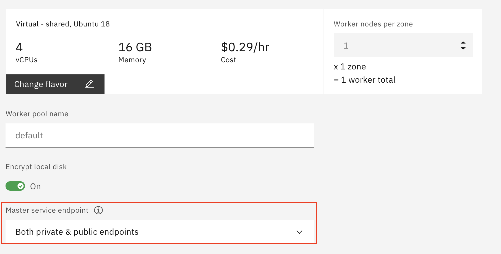
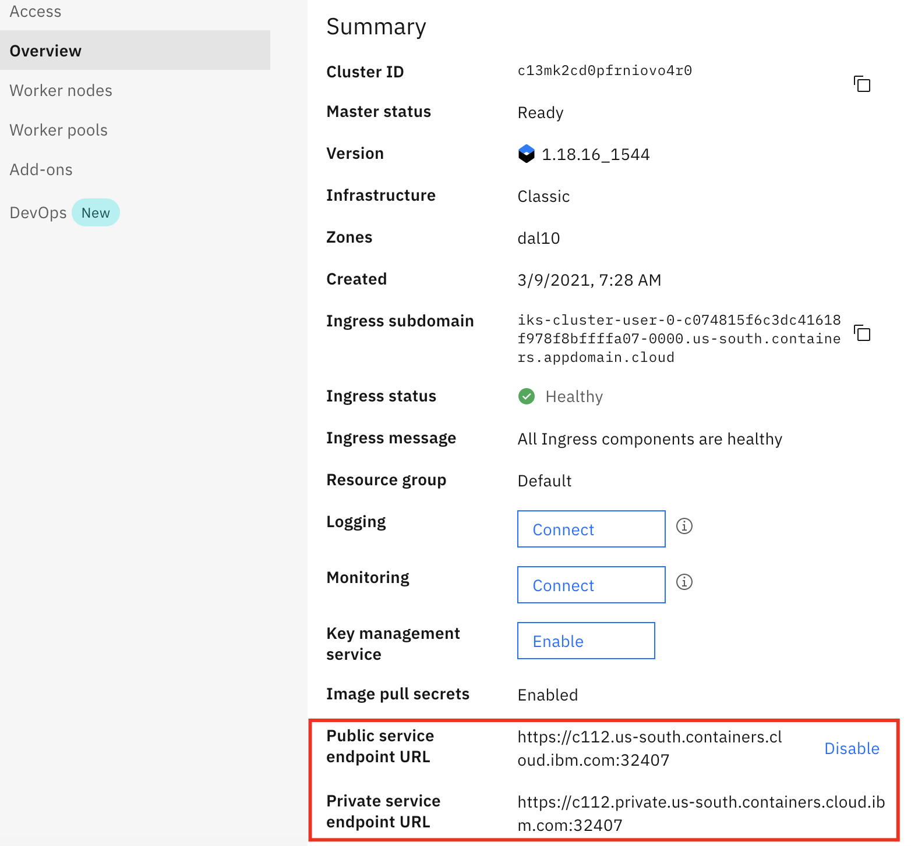
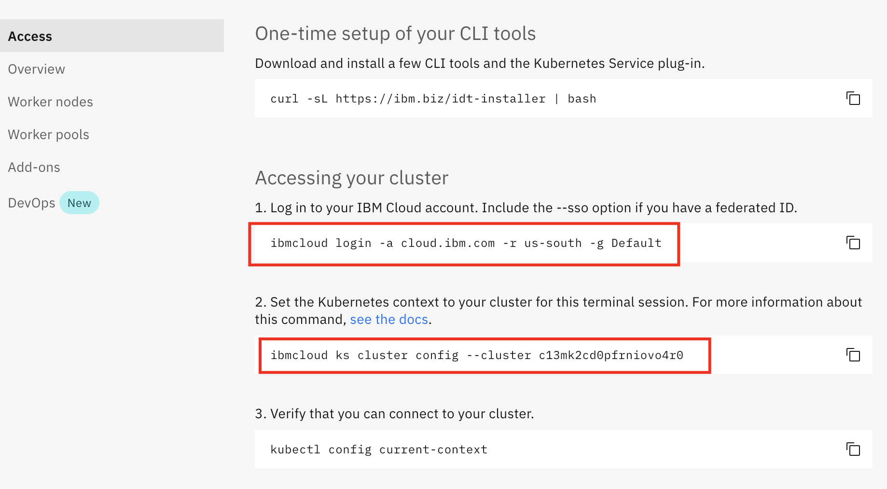

# Setup

Follow the steps listed in the section to complete the pre-requesites for the setting up the lab environment.

## Step 1. Sign up for IBM Cloud

Ensure you have an IBM Cloud ID


## Step 2. Claim your cluster

TODO: Show the steps to claim the cluster.

* a Kubernetes cluster running in IBM cloud (IKS)

Enable private endpoints if the user is creating the cluster.

> Note: it's highly recommended to enable `private endpoints` (or private service endpoint) when you create your Kubernetes cluster in IBM Cloud. The `private endpoints` can also be enabled after the cluster is created. This provides the option to use the `private endpoints` when configuring LogDNA to collect logs from your application deployed to IKS cluster.



## Step 3 - Access IBM Cloud and Kubernetes cluster

Before deploying petclinic application to IKS cluster, you need to get your working environment ready.

1. Login to [IBM Cloud](https://cloud.ibm.com) in a browser.

1. Navigate to https://cloud.ibm.com/kubernetes/clusters to see a list of available IKS clusters.

1. Select your IKS cluster from the list to open it to land at the cluster `Overview` page.

1. Ensure that the `Private service endpoint URL` is enabled at the bottom of the page.


1. In the left pane, select `Access` option. This page provides CLI commands to setup your terminal environment to work with your IKS cluster. It also has a link to start a `IBM Cloud Shell`.

    

1. Click `IBM Cloud Shell` link next to your account number on the toolbar. It's on the top-right corner of the screen. This opens `IBM Cloud Shell` window in a new tab of your browser.

1. Store cluster name in environment variable.
  ```
  export MYCLUSTER=<your cluster name>
  echo $MYCLUSTER
  ```
1. Execute the CLI commands in the `Access` tab of your IKS cluster (see above) sequentially to connect to your cluster.

1. Use CLI command `kubectl config current-context` to verify the connection to your cluster before continue the exercise.


## Step 4 Clone the repo

In the `IBM Cloud Shell`, clone the repo.

  ```bash
  git clone https://github.com/IBM/kubernetes-logging-and-monitoring.git
  cd hkubernetes-logging-and-monitoring
  ```
