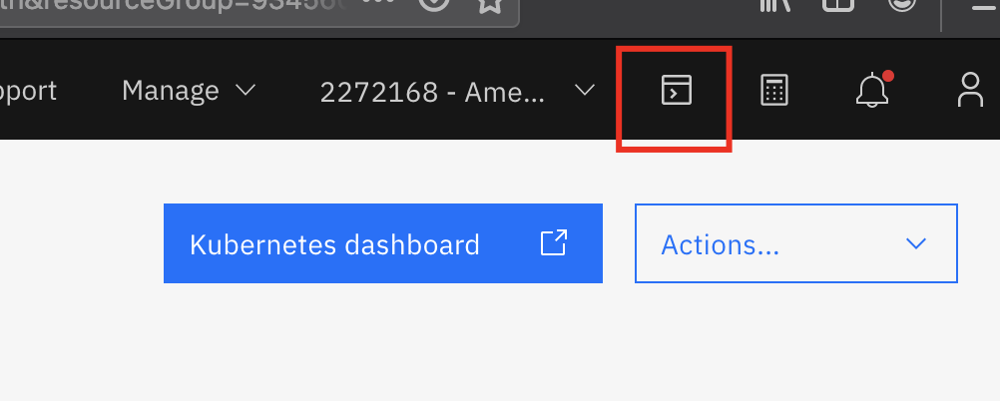
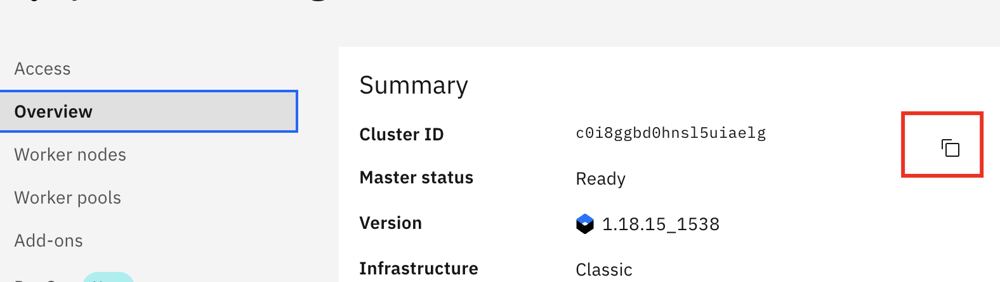

# Setup

Follow the steps listed in the section to complete the pre-requesites for the setting up the lab environment.

## Step 1: Sign up for IBM Cloud

Ensure you have an IBM Cloud ID


## Step 2: Claim and Access IBM Cloud Kubernetes cluster

Use the IBM Kubernetes cluster provided for the workshop. Alternatively, you can provision a cluster and use it for this lab.
  Find the private endpoint and VRF enablement requirements [here](https://cloud.ibm.com/docs/Log-Analysis-with-LogDNA?topic=Log-Analysis-with-LogDNA-config_agent_kube_cluster#config_agent_kube_cluster_step4).

1. Login to [IBM Cloud](https://cloud.ibm.com) in a browser and select the appropirate account under which the cluster is provisioned.

1. Navigate to https://cloud.ibm.com/kubernetes/clusters to see a list of available IKS clusters. Select your IKS cluster from the list to open it to land at the cluster `Overview` page. Observe the information under `Summary` and note how the endpoints are enabled.

    

## Step 3: Connecting to the Kubernetes cluster

1. In the left pane of Kubernetes cluster details page, select the `Access` tab. This page provides CLI commands to setup your IKS cluster using a terminal environment.

    

1. Click `IBM Cloud Shell` link next to your account number on the toolbar. It's on the top-right corner of the screen. 

    

    This opens `IBM Cloud Shell` window in a new tab of your browser. Note that additions terminal sessions can be opened by clicking the `+` icon.

    


1. Execute the CLI commands listed on the `Access` tab of your IKS cluster details ppage (see above) sequentially to connect to your cluster.

    ```
    $ ibmcloud login -a cloud.ibm.com -r us-south -g Default
    API endpoint: https://cloud.ibm.com

    Email> rj@gmail.com

    Password> 
    Authenticating...
    OK

    Select an account:
    1. Rojan J's Account (6ec1c2ec26xx49d6b5ad8b632e629c3d)
    2. Amce Corp (2c426324dd934f71a2a053c9185791ff) <-> 6272168
    Enter a number> 2
    Targeted account Amce Corp (2c426324cc934f71a2a053c9185791ff) <-> 6272168

    Targeted resource group Default

    Targeted region us-south

                          
    API endpoint:      https://cloud.ibm.com   
    Region:            us-south   
    User:              rj@gmail.com   
    Account:           Amce Corp (2c426324cc934f71a2a053c9185791ff) <-> 6272168   
    Resource group:    Default   
    CF API endpoint:      
    Org:                  
    Space:                
    ```

    ```
    $ ibmcloud ks cluster config --cluster c13mk2cd0pfrniovo4r0

    ....
    OK
    The configuration for c13mk2cd0pfrniovo4r0 was downloaded successfully.

    Added context for c13mk2cd0pfrniovo4r0 to the current kubeconfig file.
    You can now execute 'kubectl' commands against your cluster. For example, run 'kubectl get nodes'.
    If you are accessing the cluster for the first time, 'kubectl' commands might fail for a few seconds while RBAC synchronizes.

    ```

1. Use CLI command `kubectl config current-context` to verify the connection to your cluster before continue the exercise.

1. Store the `cluster id` in an environment variable.
  Copy the id from the cluster `Overview` tab as shown in the picture below and set that as the value for the `MYCLUSTER` variable.
  
  ```
  export MYCLUSTER=<your cluster id>
  ```
  Verify the cluster id set correctly.
  ```
  echo $MYCLUSTER
  ```
  ```
  $ echo $MYCLUSTER

  c13mk2cd0pfrniovo4r0
  ```


This completes the necessary prereqs for the labs.