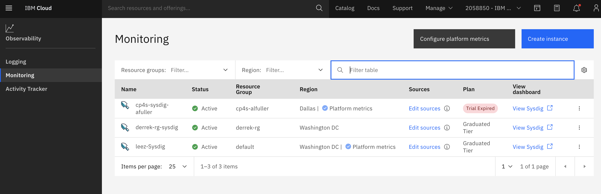
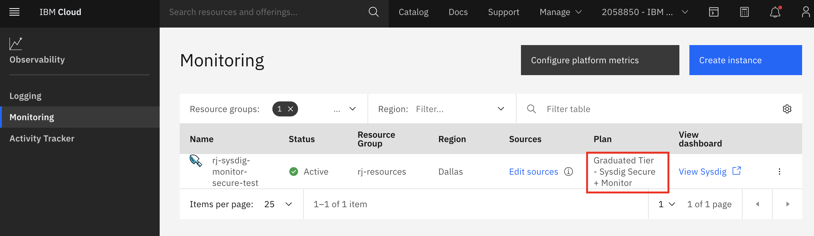
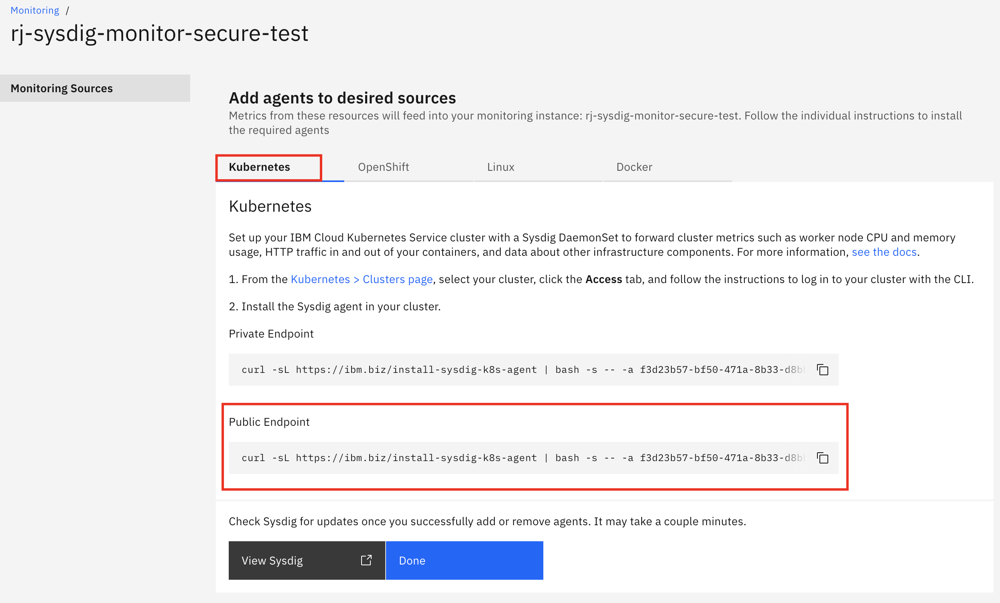
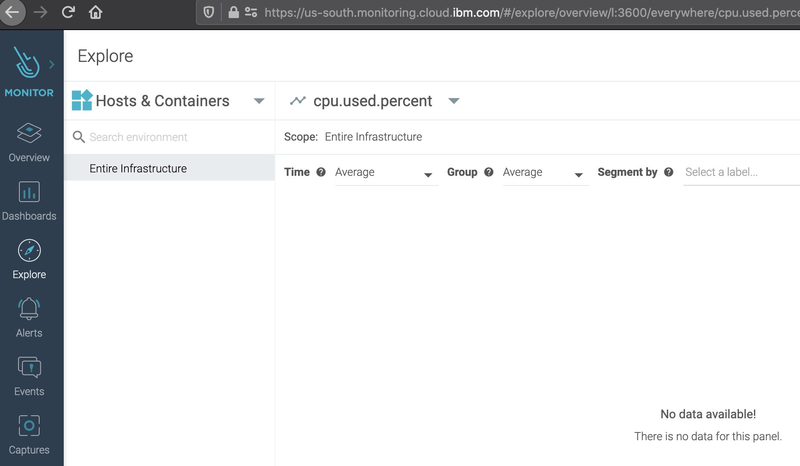

# Setup IBM Cloud Monitoring with Sysdig

`IBM Cloud Monitoring with Sysdig` allows you to capture your application and environment logs, filter out noisy or irrelevant log lines, alert, search, and archive your log data. You can build real-time dashboards with highly interactive graphs, including Counters, Gauges, Tables, and Time-Shifted Graphs.

## Step 1: Deploy IBM Cloud Monitoring with Sysdig

To deploy an instance of `IBM Cloud Monitoring with Sysdig`,

1. Login to [IBM Cloud](https://cloud.ibm.com) in a browser.

1. Click [here](https://cloud.ibm.com/observe/monitoring) open the `Monitoring` page and view the `IBM Cloud Monitoring with Sysdig` instances provisioned under your account.

    [  ](images/observability.png)

1. Select `Create instance` at the top-right corner.

1. Select a location, for example `Dallas (us-south)`. (Pick the location where the IKS cluster resides.)

1. Select `Graduated Tier - Sysdig Secure + Monitor` as the pricing plan.

1. Enter a service name or accept the default. Leave `Resource group` as `Default`.

1. Click the `Create` button to create the new service instance.

    [  ](images/observability02.png)


## Step 2: Connect your Kubernetes cluster to Sysdig

Sysdig Agent collects metrics from Kubernetes pods and sends it the Sydig instance.  The agnent should be installed on each pod of your Kubernetes to begin monitoring. The Sysdig agent is installed via a DaemonSet which ensures an instance of the agent is running on every worker node. 


1. Login to [IBM Cloud](https://cloud.ibm.com) in a browser. Open the IBM Cloud Shell and connect to the cluster as described in Step 3 [here](../../setup/). 

1. Get the service key. Goto the Sysdig instance and click on `Edit sources` to get to this screen. Copy the command shown for `Public endpoint` and edit the line to include few changes.

    

    Change the value for `sysdig_capture_enabled: true` and add a new parameter `--imageanalyzer` as shwon in the command below. These changes relates to enabling `Sysdig secure` and `Capture`. Note that the Sysdig service key, endpoint and tags are sent in as paramters.
    Run the new command in the Cloud Shell terminal.

    ```
    curl -sL https://ibm.biz/install-sysdig-k8s-agent | bash -s -- -a SYSDIG_ACCESS_KEY b -c COLLECTOR_ENDPOINT -ac 'sysdig_capture_enabled: true' --imageanalyzer
    ```
    ```
    $ curl -sL https://ibm.biz/install-sysdig-k8s-agent | bash -s -- -a 4de2635d-8615-4721-a73d-9be869a16bdb -c ingest.us-south.monitoring.cloud.ibm.com -ac 'sysdig_capture_enabled: true' --imageanalyzer
    * Detecting operating system
    * Downloading Sysdig cluster role yaml
    * Downloading Sysdig config map yaml
    * Downloading Sysdig daemonset v2 yaml
    * Downloading Sysdig agent-slim daemonset v2 yaml
    * Downloading Sysdig Image Analyzer config map yaml
    * Downloading Sysdig Image Analyzer daemonset v1 yaml
    * Creating namespace: ibm-observe
    * Creating sysdig-agent serviceaccount in namespace: ibm-observe
    * Creating sysdig-agent clusterrole and binding
    clusterrole.rbac.authorization.k8s.io/sysdig-agent created
    * Creating sysdig-agent secret using the ACCESS_KEY provided
    * Retreiving the IKS Cluster ID and Cluster Name
    * Setting cluster name as iks-cluster-user-0/c18i9ihd018m2dgi1vo0
    * Setting ibm.containers-kubernetes.cluster.id c18i9ihd018m2dgi1vo0
    * Updating agent configmap and applying to cluster
    * Setting tags
    * Setting collector endpoint
    * Adding additional configuration to dragent.yaml
    * Enabling Prometheus
    * Configuring Analysis Manager endpoint to https://ingest.us-south.monitoring.cloud.ibm.com/internal/scanning/scanning-analysis-collector. You can also use the -am option to explicitly specify it.
    * Setting Analysis Manager endpoint for Image Analyzer
    configmap/sysdig-image-analyzer created
    Processing all-icr-io as all-icr-io
    secret/all-icr-io created
    configmap/sysdig-agent created
    * Deploying the sysdig agent
    daemonset.apps/sysdig-agent created

    ...
    ```

1. The agent install step creates a set of resources under `ibm-observe` namespace. To view those changes, run the command as shown below from the CLI environment:

    ```bash
    kubectl get all -n ibm-observe
    ```
    ```
    $ kubectl get all -n ibm-observe
    NAME                              READY   STATUS              RESTARTS   AGE
    pod/sysdig-agent-kdp52            0/1     ContainerCreating   0          2m36s
    pod/sysdig-image-analyzer-zjhz7   0/1     ContainerCreating   0          2m35s

    NAME                                   DESIRED   CURRENT   READY   UP-TO-DATE   AVAILABLE   NODE SELECTOR   AGE
    daemonset.apps/sysdig-agent            1         1         0       1            0           <none>          2m36s
    daemonset.apps/sysdig-image-analyzer   1         1         0       1            0           <none>          2m35s
    ```
    Wait until the two agent pods for `agent` and `image-analyzer` are in the `Running` state. One agent is installed one per worker node. Additional pods will be listed for the LogDNA service, if installed.

## Step 3: Accessing Sysdig console

1. Go back to the [monitoring](https://cloud.ibm.com/observe/monitoring) page and click on the `View Sysdig` link to open the landing page.

    

    The `Explore` tab is open by default. We are now ready to explore various features of Sysdig.


