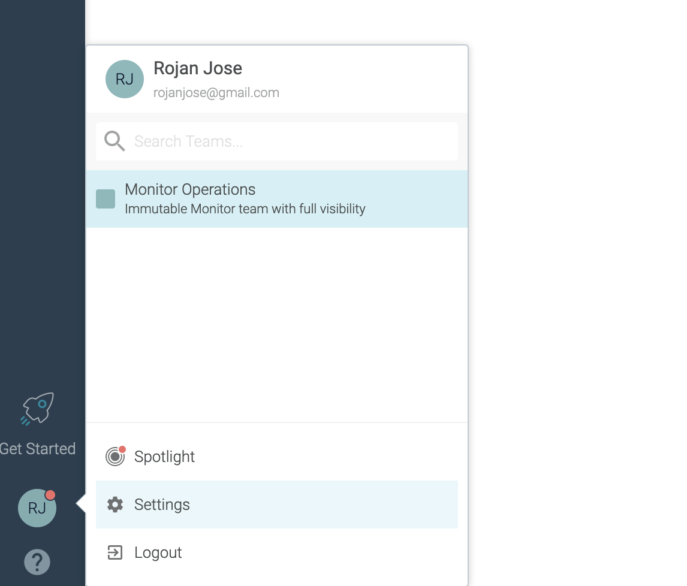
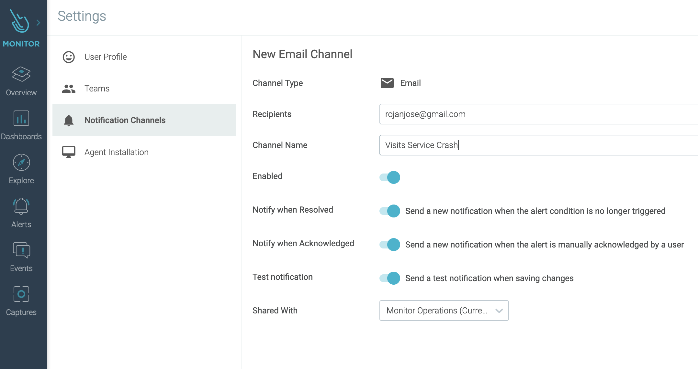

# Monitoring Kubernetes infrastructure with Sysdig Monitor 

Deploy sample `Petclinic` application to IKS cluster as described here in this [exercise](../../logdna/lab-2/). Skip the optional MySQL section. This exercise deploys the application and sets the ingress routes to access the application and the related microservices.

## Step 1: Overview of the infrastructure

The `Overview` tab provided a unified view of health, risk, capacity of the infrastructure.

1. Select the `Overview` tab and pick `Clusters` from the list of options. This view shows the overall health of the clusters being monitored. Hover over the space shown in the red arrow to get additional context menu. Use the options in this menu for further analysis.

    [  ](images/overview-cluster.png)

1. Click on the `Overview` tab and select `Workloads` to segment the view based on the workloads. Choose the `Namespace` `ibm-observe` to view the workloads belonging to the Sysdig. 

    [  ](images/overview-workloads.png)

## Step 2: Using Dashboards

Dashboards provides you a collection of relevant views and metrics for the infrastructure in a single view.

1. Let's try couple of views from the existing list of templates. Select the `Dashboard` tab and pick `Containers > Containers Resource Usage`.

    [  ](images/dashboard-container-usage.png)

1. Select the `Dashboard` tab again and pick `Troubleshooting > Process Resource Usage`.

    [  ](images/dashboard-process-usage.png)

  To add your custome view click on the Dashboards tab and select the (+) icon.

## Step 3: Troubleshooting with Explore

This tab helps you view and troubleshoot key metrics and entities of your infrastructure stack.

1. Explore net.http.request.count

    To test this out, let's atrificially trigger some traffic to the `Customer` service.
    Set the `HOST` variable and invoke the REST service API in a loop:
    
    ```
    export HOST="https://petclinic.$INGRESS_SUBDOMAIN"
    echo $HOST
    ```
    ```
    for i in `seq 1 1000` ; \
    do \
        echo -e "\n ======= Loop count: $i ========= \nCalling owners:" && \
        wget -q -O - "${HOST}/api/customer/owners" ;
    done
    ```
    Click on the `Explore` tab and select `Containerized Apps`. In the Metrics dropdown list, select `net.http.request.count` to view the request spikes.

    [  ](images/explore-net-requestcount.png)

1. View Response times between containers

    Select the `Response Times` dashboard to get a general view of network traffic between the contianers and the response times.

    [  ](images/explore-net-responsetimes.png)


## Step 4: Setting up Alerts

Alerts generate notifications based on certain conditions or events that requires further attention.

1. Crash the Vists service.
    ```
    $ kubectl get pods
    NAME                           READY   STATUS    RESTARTS   AGE
    api-gateway-575f59b7d8-vlm6x   1/1     Running   0          115m
    customers-687749cfb-vzblv      1/1     Running   0          115m
    vets-6bb6655b7f-dpf88          1/1     Running   0          115m
    visits-784749c647-rxh2n        1/1     Running   0          115m

    $ kubectl delete pods visits-784749c647-rxh2n
    pod "visits-784749c647-rxh2n" deleted
    ```
1. Setup notification channel

    Open the settings menu from the top left bottom.

    

    Add a `Notification Channel` of type `Email`.

    [  ](images/email-notification.png)

1. Adding a new Alert

    Click on the `Alerts` tab and then click on `(+) Add Alert` at the top right. Select `Event` as the `Alert Type`.
    Enter `ExitCode = 143` for `Tag or Description`, `Source Tag` value as `containerd`. Enable the notification channel `Visits Service Crash` and click on the `CREATE` button.

    [  ](images/visits-service-alert.png)

    Rerun the Visits service crash set to trigger an alert. You will receive separate notifications for `Triggered` and `Resolved` status.

    


## Step 5: Analysing Events

The `Events` view displays a comprehensive list of events that have occurred in the environment. Let's create one additional event prior to looking at the Events view. `noimage-service.yaml` poiints to a non-existent image.

1. Create the `Image Pull` error event

    ```
    cd $HOME/kubernetes-logging-and-monitoring/src
    
    $ kubectl create -f k8s/monitor/noimage-service.yaml
    deployment.apps/missing-image created
    service/missing-image-service created
    ```
    
    The pod with missing image will show a status of `ErrImagePull`.

    ```
    kubectl get pods
    NAME                             READY   STATUS         RESTARTS   AGE
    api-gateway-575f59b7d8-vlm6x     1/1     Running        0          11h
    customers-687749cfb-vzblv        1/1     Running        0          11h
    missing-image-6c677574d8-zqc57   0/1     ErrImagePull   0          54s
    vets-6bb6655b7f-dpf88            1/1     Running        0          11h
    visits-784749c647-t6tb9          1/1     Running        0          9h
    ```

1. View the events

    Open the Events view to find `Back Off Container Start or Image Pull` and `Container Image Pull, Create or Start Failed` at the top of the events list. Select the Event to get additional details.

    [  ](images/events-error-imagepull.png)


## Step 6: Creating Captures

The `Captures` tab gives a list of capture files with system calls and OS events for further analysis.

1. Create a `Capture`

    Go to the `Explore` view. From the list of `Containerized Apps`, select the `customer-service` docker image. Then select `Sysdig Capture` from the top right menu.

    [  ](images/capture-customer.png)

    Enter a name for the capture and click `START CAPTURE`.

    [  ](images/capture-customer-2.png)


