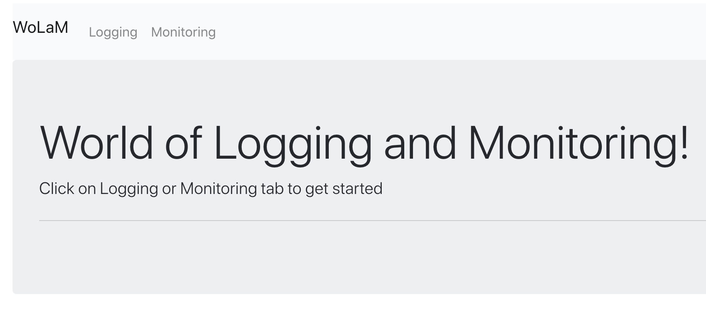
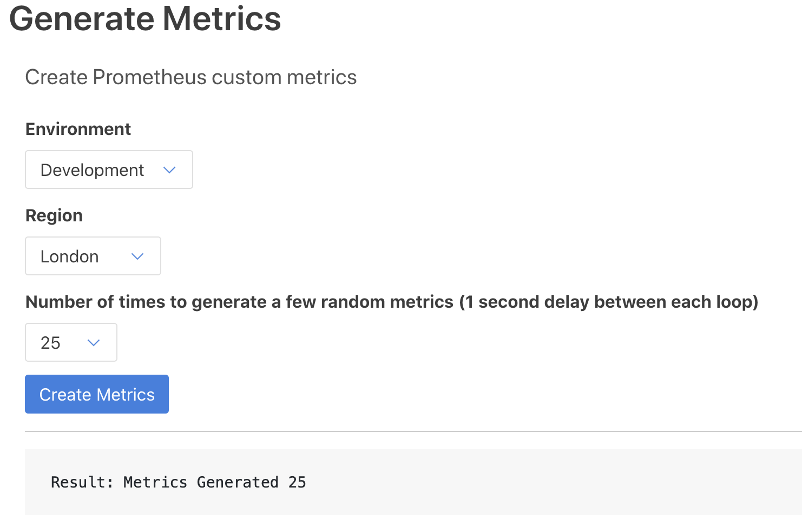
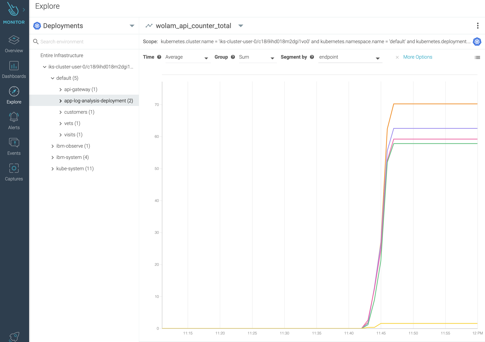

# Monitoring with custom metrics

In this exercice, we will see how to generatge custom metircs using a Prometheus client and mock multiple access to API endpoints.
The sample application called `WoLaM` extracted from the tutorial [here](https://cloud.ibm.com/docs/solution-tutorials?topic=solution-tutorials-application-log-analysis#deploy_configure_kubernetes_app). This project includes the code to generate custom metrics. 

For instance, review line 29 [here](https://github.com/IBM-Cloud/application-log-analysis/blob/master/app/views.py) to see how the custom metric
`wolam_api_counter` is defined.

## Step 1: Setup the application 

1. Setup manifests for the application

    Ensure the valeu of `INGRESS_SUBDOMAIN` is set based on the sample application deploy steps from this [lab](../../logdna/lab-2/#step-2-deploy-ingress-resource).

    ```
    echo "Ingress subdomain: ${INGRESS_SUBDOMAIN}"
    ```
    Replace `<INGRESS_SUBDOMAIN>` in `k8s/ingress.yaml` file with the value that you retrieved in the previous step by running the following command:

    ```bash
    sed -i "s/<INGRESS_SUBDOMAIN>/${INGRESS_SUBDOMAIN}/" k8s/monitor/app-log-analysis.yaml
    ```
    Users on Mac:
    ```bash
    sed -i "" "s/<INGRESS_SUBDOMAIN>/${INGRESS_SUBDOMAIN}/" k8s/monitor/app-log-analysis.yaml
    ```
    Verify the igress value was substituted correctly:
    ```
    $ more k8s/app-log-analysis.yaml
    ...
    spec:
    rules:
    - host: observe.iks-cluster-user-0-c074815f6c3dc41618f978f8bffffa07-0000.us-south.containers.appdomain.cloud
        http:
        paths:
        - path: /(.*)
    ...
    ```

1. Run the applicaiton

    Run the `kubectl` command to deploy the application. Two pods with name `app-log-analysis-deployment` should show in `Running` status.

    ```
    kubectl create -f k8s/monitor/app-log-analysis.yaml
    
    deployment.apps/app-log-analysis-deployment created
    service/app-log-analysis-svc created
    ingress.networking.k8s.io/app-log-analysis-ingress created

    $ kubectl get pods
    
    NAME                                          READY   STATUS             RESTARTS   AGE
    api-gateway-575f59b7d8-vlm6x                  1/1     Running            0          12h
    app-log-analysis-deployment-595df69c5-77l5h   1/1     Running            0          20s
    app-log-analysis-deployment-595df69c5-gxwvh   1/1     Running            0          20s
    customers-687749cfb-vzblv                     1/1     Running            0          12h
    missing-image-6c677574d8-zqc57                0/1     ImagePullBackOff   0          78m
    vets-6bb6655b7f-dpf88                         1/1     Running            0          12h
    visits-784749c647-t6tb9                       1/1     Running            0          10h
    ```

    Use the application endpoint to get to the `WoLaM` landing page.

    ```
    echo "https://observe.${INGRESS_SUBDOMAIN}"
    ```
    ```
    echo "https://observe.${INGRESS_SUBDOMAIN}"

    https://observe.iks-cluster-user-0-c074815f6c3dc41618f978f8bffffa07-0000.us-south.containers.appdomain.cloud
    ```

    [  ](images/wolam-landing.png)

    The application is now ready to send custom metric data.

## Step 2: Monitor Metrics

1. Generate metrics

    Go to the `WoLaM` application, select the `Monitoring` tab and generate few metrics. for eg: `Development`, `London` & `25`.

    [  ](images/wolam-gen-dev-london.png)


2. View metrics

    To monitor the calls to a given api endpoint of the application, From the Explore tab, select Deployments.
    Select `Metrics > Prometheus > wolam_api_counter_total` in the Metrics and Dashboards dropdown.
    Select `Time: Average, Group: Sum, Segment: endpoint`.

    Go back to the `WoLaM` application, generate a few metrics after changing the region.
    To monitor the calls to a given api endpoint of the application by region,
    Select `Time: Average, Group: Sum, Segment: region`.

    [  ](images/wolam-api-counter-total.png)

